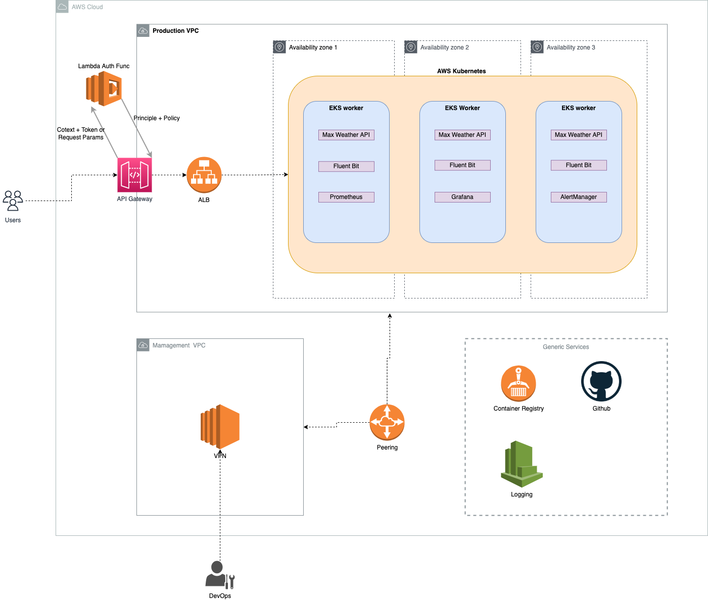
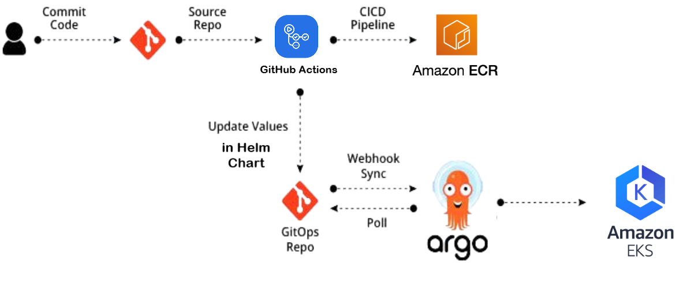

# Max Weather Infrastructure

## Requirements

- `aws cli`
- `terraform 1.1.9`

## Project structure

```
.
|-- helmcharts
|-- terraform
|-- argocd
|-- docs
```

1. The `helmcharts` Stores the Helm Charts for the Max Weather application.
2. The `terraform` Cloud and infrastructure setup.
3. The `argocd` Store ArgoCD project & application for GitOps
4. The `docs` Technical documentation intended for maintainers and developers
## Design Goals

The primary design goals are:

* Provide high availability to the Max Weather application
* Adhere to recent best practices and latest standards
* Scalable to fully redundant cluster setups
* Very high degree of automation, i.e., fully automated setup, testing, etc.


## Architecture diagram



## Setup

You need to have a AWS account and export your credentials.

```
export AWS_ACCESS_KEY_ID="anaccesskey"
export AWS_SECRET_ACCESS_KEY="asecretkey"
```

## Provision Infrastructure with Terraform

### 1- Initialize terraform configuration

```bash
cd terraform && terraform init
```

> command is used to initialize a working directory containing Terraform configuration files.

### 2- Create terraform workspace

```bash
terraform workspace new prod
```

> command is used to create new terraform workspace. [Read more about workspace](https://www.terraform.io/language/state/workspaces)

### 3- Validate terraform configuration

```bash
terraform validate .
```

> command is used to validate terraform script

#### 4- Create terraform plan

```bash
terraform plan -var-file=env/prod.tfvars
```

> command creates an execution plan, which lets you preview the changes that Terraform plans to make to your infrastructure.

#### 5- Apply terraform plan

```bash
terraform apply -var-file=env/prod.tfvars
```

> command executes the actions proposed in a Terraform plan to create or update infrastructure.

#### 6- Cleanup

```bash
terraform destroy -var-file=env/prod.tfvars -auto-approve
```
> command is a convenient way to destroy all remote objects managed by a particular Terraform configuration.

### CI/CD workflows
Argo CD is a declarative, GitOps continuous delivery tool for Kubernetes. Application definitions, configurations and environments should be declarative and version controlled. Application deployment and life cycle management should be automated, auditable and easy to understand.



#### How does it work?
After a successful CI pipeline, new images are pushed to the Docker registry and respective image tags are committed into the GitOps repository.

Sync action is triggered through webhook action from CI after commit or after a regular polling interval.

Argo CD runs as a controller on the Kubernetes cluster, which continuously monitors running applications and compares the current live state against the desired target state (as specified in the GitOps repo).

The controller detects OutOfSync application state, which is done by diffing Helm manifest template outputs and optionally takes corrective action.